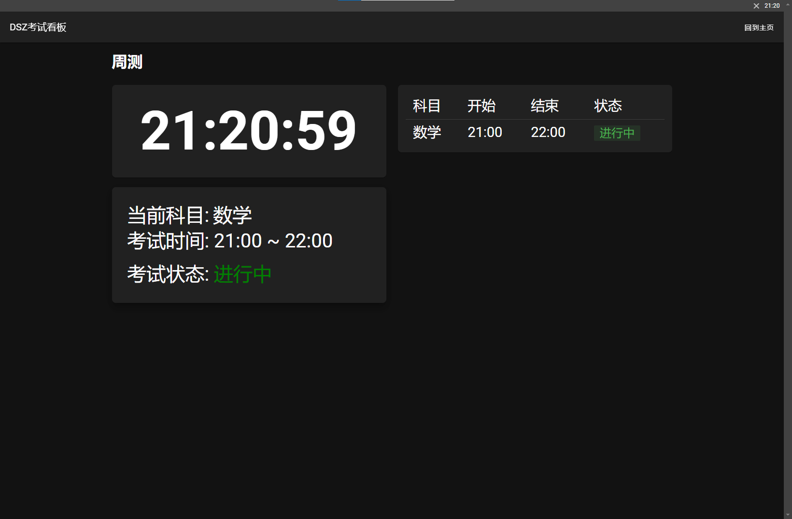
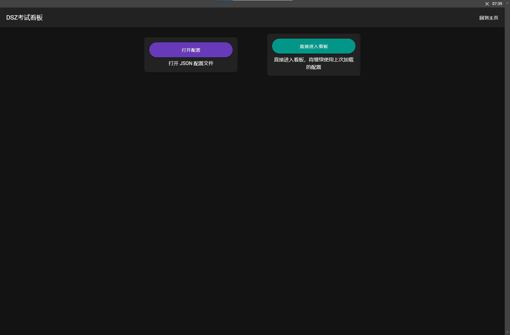

# DSZ考试展板·改（指不定期对原项目修修补补）



[](https://github.com/hello8693DSZ/dsz-exam-showboard)
[](https://github.com/hello8693DSZ/dsz-exam-showboard/releases/latest)
[](https://github.com/hello8693DSZ/dsz-exam-showboard/releases/)

## 软件介绍

- 您可以查看下方的详细介绍
- 使用Vue + TypeScript + JavaScript制作，使用Node.js+Electron完善系统级功能并打包。
- 欢迎给作者点个右上角的Star或者给作者宣传一波
- [【点我加群】DSZ考试看板QQ交流群: 901670561](http://qm.qq.com/cgi-bin/qm/qr?_wv=1027&k=TIGkmk-8lHUtUj_D4BVZ95tY-MMA1IwF&authKey=2TIKZ838Aq7vWGyiMKx9vwi%2B1MfHqpCv7NZ4XpTl4QhpAW03ac7x8Gc%2FnnOougVi&noverify=0&group_code=901670561)

## 功能

### 展示考试信息

- [x] 展示考试名称
- [x] 展示当前时间
- [x] 展示当前考试科目名称
- [x] 展示考试开始，结束时间
- [x] 展示考试状态

### 其他功能

- [x] 考试结束十五分钟前预警
- [ ] 集控管理（正在开发中）

## 软件截图

### 主界面截图



### 考试界面截图


## 开始使用

### 下载

对于普通用户，可以在以下渠道下载到本软件

下载 [Realeases](https://github.com/hello8693DSZ/dsz-exam-showboard/releases) | [Actions](https://github.com/hello8693DSZ/dsz-exam-showboard/actions)

### 准备配置文件

#### 新建格式为`json`的配置文件，模板如下

```json
{
  "examName": "",
  "message": "",
  "examInfos": [
    {
      "name": "",
      "start": "XXXX-XX-XXTXX:XX:XX",
      "end": "XXXX-XX-XXTXX:XX:XX"
    }
  ]
}
```

### 运行

下载完成后，将软件双击运行，等待进度条走完，双击运行桌面上的名为ExamShowboard的快捷方式

### 导入配置

进入主界面后，点击打开配置按钮，选择您已配置好的配置文件，下次进入时可点击直接进入看板按钮进入考试看板，继续使用上次加载的配置文件。

## 开发

要在本地编译应用您需要安装以下负载和工具

- [VSCode](https://code.visualstudio.com/) + [ESLint](https://marketplace.visualstudio.com/items?itemName=dbaeumer.vscode-eslint) + [Prettier](https://marketplace.visualstudio.com/items?itemName=esbenp.prettier-vscode) + [Volar](https://marketplace.visualstudio.com/items?itemName=Vue.volar) + [TypeScript Vue Plugin (Volar)](https://marketplace.visualstudio.com/items?itemName=Vue.vscode-typescript-vue-plugin)

### 注意事项

必须使用Yarn包管理。Node版本要求为20。

### Project Setup

#### 安装

```bash
$ yarn
```

#### Development

```bash
$ yarn dev
```

#### 构建

```bash
# For windows
$ yarn build:win

# For macOS
$ yarn build:mac

# For Linux
$ yarn build:linux
```

### 说明

如果dev模式页面不显示或按钮点击无效等问题，请连续刷新至少3次后再进行操作。build后没有此问题。

我们欢迎想要为本应用实现新功能或进行改进的同学提交 [Pull Request](https://github.com/hello8693DSZ/dsz-exam-showboard/pulls)

## Stars 历史

[](https://starchart.cc/hello8693DSZ/dsz-exam-showboard)

<div align="center">
